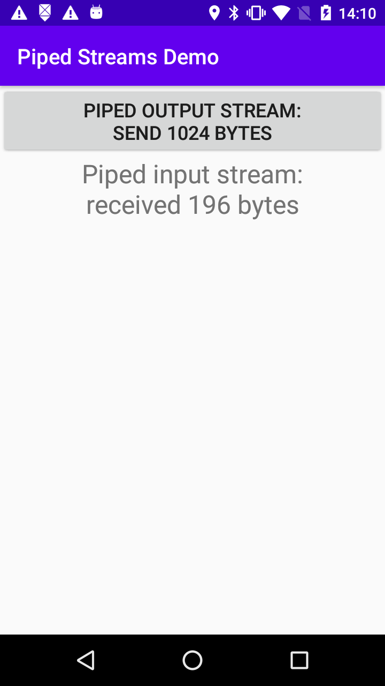
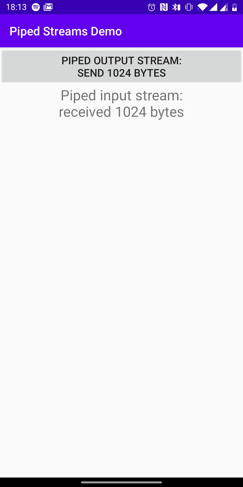

This is a simple demo where `PipedOutputStream` is sending 1024 bytes
to `PipedInputStream`. OpenJDK used by Android 7 and later versions will always receive 1024 bytes,
while Harmony-based Android 6 will often receive less than 1024 bytes.
Both implementations formally comply with Java specification, and relying
on OpenJDK behavior may result in bugs when deploying the app on Harmony-based
device. This seems to be the source of a bug in Google's Exposure Notifications
framework, which prevents German coronavirus app from working on Android 6
devices: [#737](https://github.com/corona-warn-app/cwa-app-android/issues/737)

Android 6                  |  Android 10
:-------------------------:|:-------------------------:
  |  

